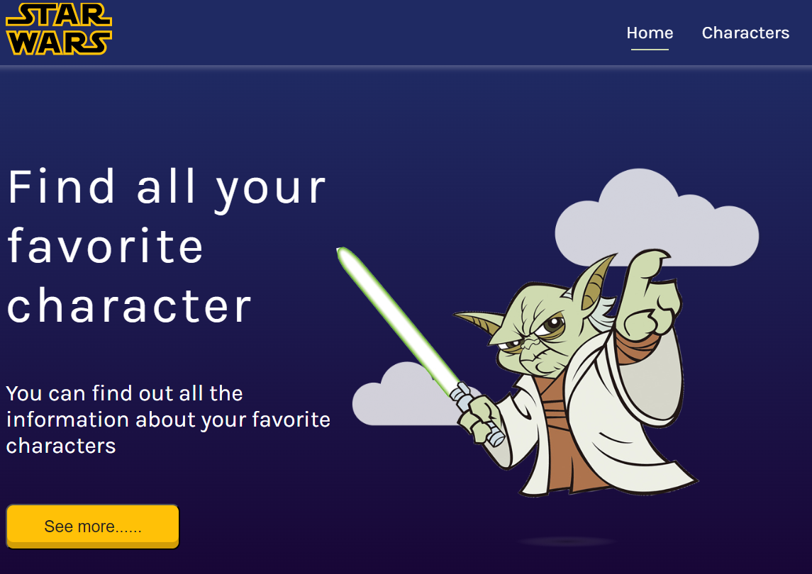
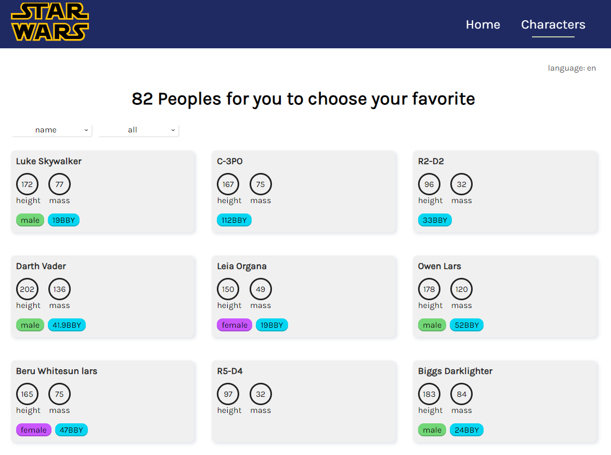
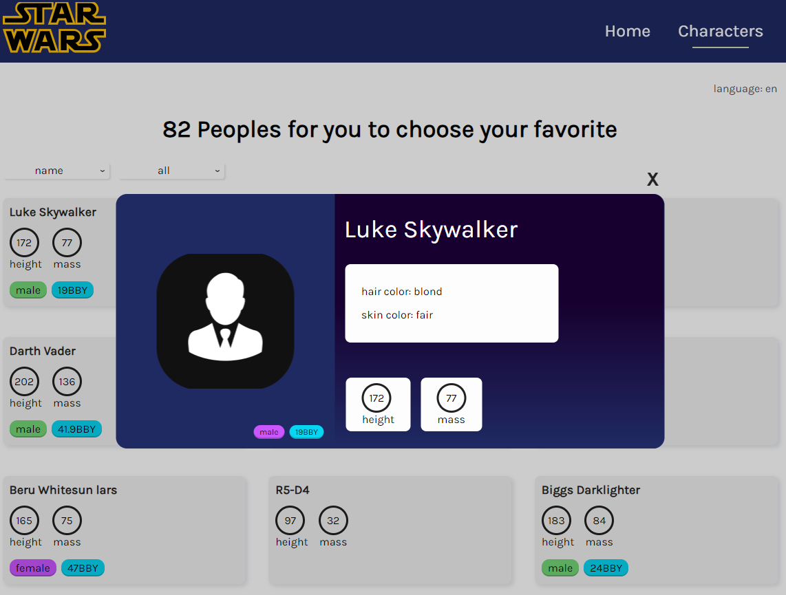

# SWAPI Test task

Тестовое задание.
С помощью SWAPI получает информацию о персонажах и отображает её. Реализованы пагинация, фильтрация, модальное окно, смена языка.

Ссылка на прод: https://swapi-test-task.vercel.app/

Стэк: JavaScript, ReactJS, React Router, Redux, Thunk, Redux-Toolkit, HTML, CSS

# Скриншоты

